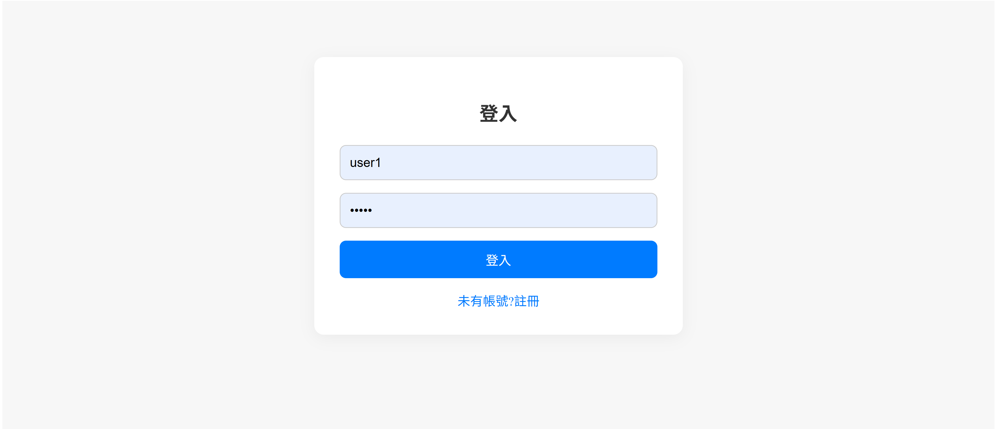

# 即時聊天室系統 (Real-Time Chat App)

[chat-production-70dc.up.railway.app](https://chat-production-70dc.up.railway.app)

這是一個基於 Spring Boot + Angular 的全端即時聊天室應用，支援 JWT 認證、RabbitMQ 傳訊、WebSocket 即時通訊、Redis 快取與 MongoDB 儲存，並實作分頁加載歷史訊息。

---

## 專案結構
---

## 功能特色

- 使用者註冊、登入、登出
- JWT 認證與 Token 自動刷新
- 私人聊天（支援聊天室列表）
- 即時訊息傳送（WebSocket + STOMP + RabbitMQ）
- 訊息快取（Redis）與儲存（MongoDB）
- 分頁載入歷史訊息
- 聊天時動態獲取對方暱稱（username）

```
試用帳號(user pass)
user1 pass1
user2 pass2
```

---

## 技術棧

### 後端（main）
- Spring Boot 3
- Spring Security + JWT
- Spring WebSocket + STOMP
- RabbitMQ
- Redis
- MongoDB

### 前端（src）
- Angular 15+
- RxJS（即時資料處理）
- Angular Router（聊天室切換）
- JWT 攔截器、自動刷新與AuthGuard

---

1. 使用者註冊、登入、登出



- 使用者可透過註冊畫面建立帳號，登入後獲得 JWT 與 Refresh Token。
- Token 有效期過後，系統會自動刷新，保持使用者狀態。
- 登出功能位於導覽列，執行登出後會將原本 Token 加入 Redis 黑名單。

2. 私人聊天（支援聊天室列表）


- 聊天室清單依照最近訊息排序，支援即時更新。
- 使用 WebSocket + RabbitMQ 傳送訊息，實時更新對話內容。
- 後端支援分頁查詢歷史訊息。

3. 前後端部署


- 前後端使用 Dockerfile 容器化並部署於 Railway
- 前端使用 NGINX 進行反向代理，後端暴露 WebSocket 與 API。